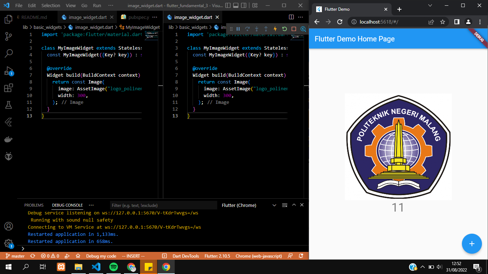
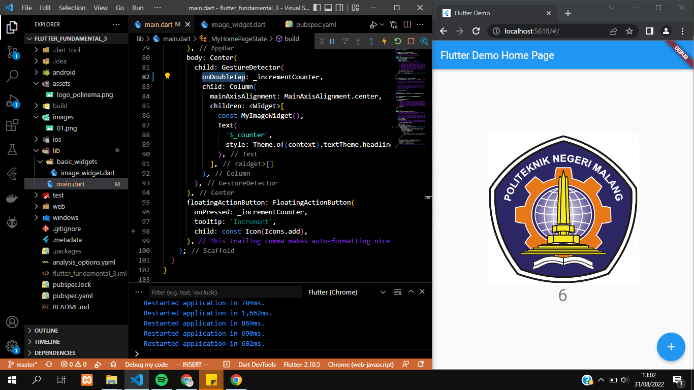

# flutter_fundamental_3

A new Flutter project.

## Praktikum 1 - Menerapkan Gesture Detector
-  Pada percobaan ini ditambahkan gesture detector yang mengakibatkan ketika gambar atau angka dibawah gambar di klik/tap maka angka dibawah gambar akan bertambah

- Pada percobaan ini diminta untuk mengubah kode bagian onTap menjadi onDoubleTap. Ketika menggunakan onDoubleTap  maka perlu melakukan double klik/tap pada gambar agar angka dibawah gambar bertambah.
