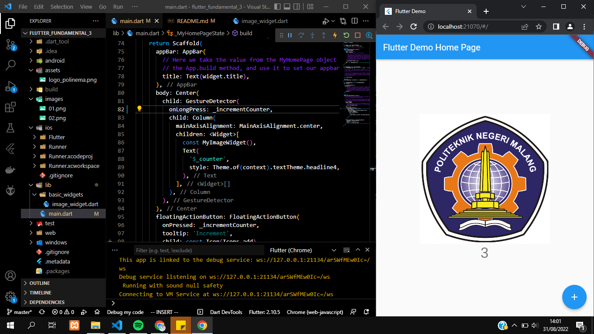
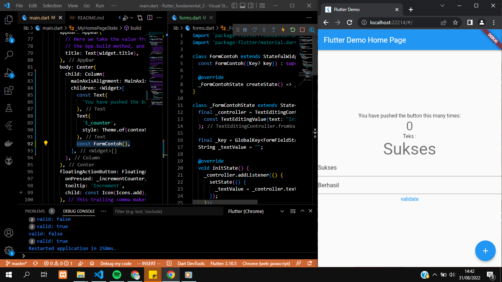
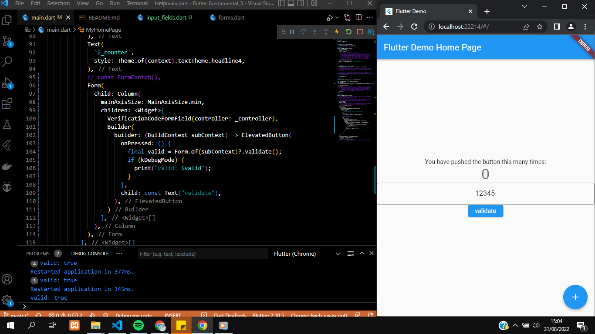

# flutter_fundamental_3

A new Flutter project.

## Praktikum 1 - Menerapkan Gesture Detector
-  Pada percobaan ini ditambahkan gesture detector yang mengakibatkan ketika gambar atau angka dibawah gambar di klik/tap maka angka dibawah gambar akan bertambah

- Pada percobaan ini diminta untuk mengubah kode bagian onTap menjadi onDoubleTap. Ketika menggunakan onDoubleTap  maka perlu melakukan double klik/tap pada gambar agar angka dibawah gambar bertambah.

- Pada percobaan ini diminta untuk mengubah kode bagian onTap menjadi onLongPress. Ketika menggunakan onLongPress  maka perlu menekan lebih lama pada gambar agar angka dibawah gambar bertambah.

## Praktikum 2 - Menerapkan Input Widget dan Forms
- Pada percobaan ini menerapkan input widget dan forms. Hasil pada percobaan ini yaitu terdapat dua forms, yaitu forms yang menggunakan validator dan forms biasa/tanpa validator. Form pertama menggunakan validator, ketika tidak ada yang diinputkan pada form maka akan muncul tulisan tidak boleh kosong. Sedangkan ketika ada yang diinputkan maka hasil inputan tersebut akan muncul diatas forms. Kemudian forms kedua merupakan forms biasa tanpa ada validator.

## Praktikum 3 - Menerapkan Custom Input dan FormField Widget
- Hasil pada praktikum ini yaitu membuat forms yang hanya dapat di isi angka saja.
